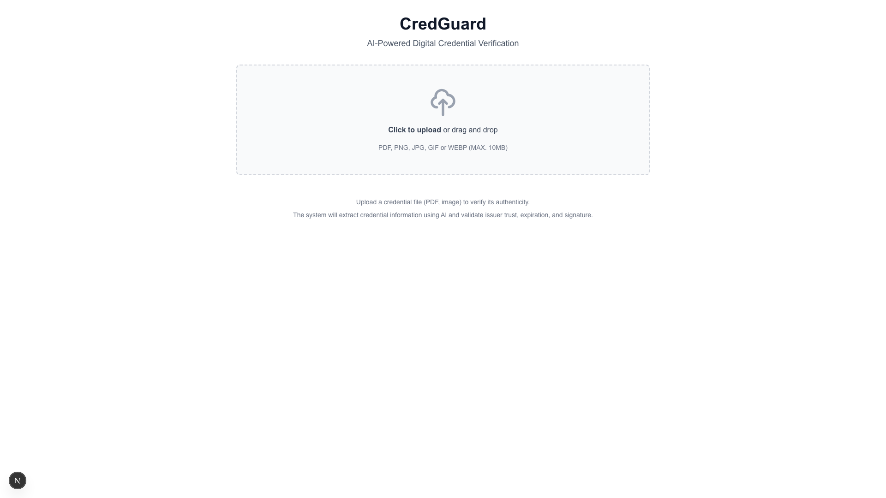

# CredGuard

AI-Powered Digital Credential Verification System



## Overview

CredGuard is a digital credential verification system that demonstrates:
- Digital identity and verifiable credentials
- AI extraction and reasoning
- Java backend architecture with clean architecture principles
- Modern REST API design

## Architecture

The backend follows clean architecture with clear layer separation:

- **domain/** - Pure domain models (Java records), no framework dependencies
- **application/** - Business logic and use cases
- **web/** - REST controllers and DTOs
- **infra/** - External integrations (AI, storage, etc.)

## Features

### ✅ Implemented

1. **Verification Pipeline**
   - Issuer trust validation
   - Expiry validation
   - Signature validation with Nimbus JOSE (JWT/JWS verification)
   - Combined verification results

2. **REST API Endpoints**
   - `POST /api/credentials/verify` - Verify a credential from JSON
   - `POST /api/credentials/upload` - Upload file and verify extracted credential
   - `GET /health` - Health check endpoint

3. **AI Extraction Service**
   - OpenAI Vision API integration
   - Extracts credential information from PDFs and images
   - Mock mode for testing without API key
   - Maps AI output to domain models

4. **Error Handling**
   - Global exception handler
   - Validation error handling
   - File upload error handling

5. **Testing**
   - Unit tests for VerificationService
   - Comprehensive test coverage

6. **Frontend (Next.js + Tailwind)**
   - Modern React-based UI with TypeScript
   - Drag-and-drop file upload
   - Real-time verification results display
   - JSON viewer for credential details
   - Dark mode support
   - Responsive design

## Getting Started

### Prerequisites

**Backend:**
- Java 21+
- Maven 3.6+

**Frontend:**
- Node.js 18+
- npm or yarn

### Configuration

Set environment variables:

```bash
# Required for AI extraction (or use mock mode)
export OPENAI_API_KEY=your-api-key-here

# Optional: Enable mock mode for testing without API key
export AI_MOCK_MODE=true
```

Or configure in `application.properties`:

```properties
ai.openai.api-key=your-api-key
ai.mock-mode=false
```

### Running the Backend

```bash
cd backend
mvn spring-boot:run
```

The API will be available at `http://localhost:8080`

### Running the Frontend

```bash
cd frontend
npm install
npm run dev
```

The frontend will be available at `http://localhost:3000`

**Note:** Make sure the backend is running before starting the frontend, or update `NEXT_PUBLIC_API_URL` in `.env.local` to point to your backend URL.

### Testing

```bash
cd backend
mvn test
```

## API Usage

### Verify Credential (JSON)

```bash
curl -X POST http://localhost:8080/api/credentials/verify \
  -H "Content-Type: application/json" \
  -d '{
    "id": "cred-123",
    "type": "VerifiableCredential",
    "issuer": {
      "id": "did:example:issuer",
      "displayName": "Example University",
      "trusted": true
    },
    "subject": "did:example:subject",
    "issuedAt": "2024-01-01T00:00:00Z",
    "expiresAt": "2025-01-01T00:00:00Z",
    "claims": {
      "degree": "Bachelor of Science"
    }
  }'
```

### Upload and Verify File

```bash
curl -X POST http://localhost:8080/api/credentials/upload \
  -F "file=@credential.pdf"
```

## Project Structure

```
credguard/
├── backend/
│   ├── src/main/java/com/credguard/
│   │   ├── domain/              # Domain models
│   │   ├── application/         # Business logic
│   │   │   └── ai/              # AI extraction service
│   │   ├── web/                 # REST controllers
│   │   │   └── dto/             # Data transfer objects
│   │   └── infra/               # Infrastructure
│   │       ├── ai/              # AI client implementations
│   │       └── crypto/          # Signature verification (Nimbus JOSE)
│   └── src/test/                # Tests
└── frontend/
    ├── app/                     # Next.js App Router pages
    ├── components/              # React components
    │   ├── FileUpload.tsx       # Drag-and-drop upload
    │   ├── VerificationResult.tsx
    │   └── CredentialViewer.tsx # JSON/formatted viewer
    └── lib/api/                 # API client
```

## Features Implemented

✅ **Complete Verification Pipeline** - Issuer trust, expiry, and signature validation  
✅ **AI Extraction Service** - OpenAI Vision API integration with mock mode  
✅ **REST API** - Full CRUD operations for credential verification  
✅ **Frontend UI** - Modern Next.js application with drag-and-drop upload  
✅ **Signature Verification** - Nimbus JOSE integration for JWT/JWS verification  
✅ **Error Handling** - Comprehensive error handling and validation  
✅ **Testing** - Unit tests for core services  

## Next Steps

- [ ] Add blockchain anchoring
- [ ] AWS/cloud deployment (Terraform/CDK)
- [ ] Enhanced AI extraction with better prompts
- [ ] Support for multiple AI providers
- [ ] Credential storage and history
- [ ] User authentication and authorization

## License

MIT
