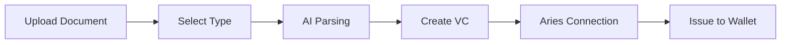

<div align="center">

# 🛡️ CredGuard

### AI-Powered Digital Credential Verification & Issuance Platform

[](https://openjdk.org/)
[](https://spring.io/projects/spring-boot)
[](https://nextjs.org/)
[](https://www.typescriptlang.org/)
[](https://tailwindcss.com/)
[](https://opensource.org/licenses/MIT)

*A comprehensive digital identity platform for verifying and issuing W3C-compliant verifiable credentials using AI-powered document extraction*

[Features](#-features) •
[Quick Start](#-quick-start) •
[Architecture](#-architecture) •
[API Reference](#-api-reference) •
[Documentation](#-documentation)

---

</div>

## 📸 Screenshots

<div align="center">


*CredGuard's intuitive verification interface showing credential validation with detailed results*

</div>

---

## ✨ Features

### 🔍 Credential Verification
- **Multi-layer Validation** — Comprehensive verification pipeline including issuer trust, expiry, and signature validation
- **AI-Powered Extraction** — Automatically extract credential data from PDFs and images using OpenAI Vision API
- **JWT/JWS Support** — Industry-standard signature verification with Nimbus JOSE library
- **Real-time Results** — Instant feedback with detailed validation status and explanations

### 📄 Credential Issuance
- **Physical to Digital** — Transform physical documents (passports, licenses, certificates) into verifiable digital credentials
- **W3C Compliance** — Issue credentials following W3C Verifiable Credentials standard
- **Aries Integration** — Seamless delivery to Aries-compatible mobile wallets
- **Multiple Document Types** — Support for passports, driver's licenses, degree certificates, and more

### 🎨 Modern User Interface
- **Drag & Drop Upload** — Intuitive file upload experience
- **Dark Mode Support** — Beautiful UI in light and dark themes
- **Responsive Design** — Works seamlessly on desktop and mobile devices
- **Real-time Feedback** — Live status updates during processing
- **Formatted & JSON Views** — Toggle between human-readable and raw credential views

### 🔒 Security & Privacy
- **Cryptographic Verification** — Secure signature validation using industry standards
- **No Permanent Storage** — Documents processed in memory, not stored
- **Secure API Communication** — Protected REST endpoints
- **DID-based Authentication** — Decentralized identifier support for wallet connections

---

## 🚀 Quick Start

### Prerequisites

| Component | Requirement |
|-----------|-------------|
| **Java** | 17+ (LTS recommended) |
| **Maven** | 3.6+ |
| **Node.js** | 18+ |
| **npm/yarn** | Latest |

### 1️⃣ Clone the Repository

```bash
git clone https://github.com/Sanjeev-Panday/credguard.git
cd credguard
```

### 2️⃣ Configure Environment

**Option A: Environment Variables**
```bash
# Required for AI extraction (or use mock mode for development)
export OPENAI_API_KEY=your-api-key-here

# Enable mock mode for testing without API key
export AI_MOCK_MODE=true

# For credential issuance (optional)
export ARIES_MOCK_MODE=true
```

**Option B: Application Properties** (`backend/src/main/resources/application.properties`)
```properties
ai.openai.api-key=your-api-key
ai.mock-mode=true
aries.mock-mode=true
```

### 3️⃣ Start the Backend

```bash
cd backend
mvn spring-boot:run
```

The API server will start at `http://localhost:8080`

### 4️⃣ Start the Frontend

```bash
cd frontend
npm install
npm run dev
```

The web application will be available at `http://localhost:3000`

### 5️⃣ Verify Installation

Open your browser and navigate to `http://localhost:3000`. You should see the CredGuard interface ready for credential verification!

---

## 🏗️ Architecture

CredGuard follows **Clean Architecture** principles with clear separation of concerns:

```
credguard/
├── 📁 backend/                          # Java Spring Boot Backend
│   └── src/main/java/com/credguard/
│       ├── 📁 domain/                   # 🎯 Domain Models (Pure Java Records)
│       │   ├── Credential.java
│       │   ├── VerifiableCredential.java
│       │   ├── VerificationResult.java
│       │   └── ...
│       ├── 📁 application/              # 💼 Business Logic & Use Cases
│       │   ├── VerificationService.java
│       │   ├── CredentialIssuanceService.java
│       │   ├── 📁 ai/                   # AI extraction service
│       │   └── 📁 validation/           # Validation strategies
│       ├── 📁 web/                      # 🌐 REST Controllers & DTOs
│       │   ├── CredentialController.java
│       │   ├── CredentialIssuanceController.java
│       │   └── 📁 dto/                  # Data Transfer Objects
│       └── 📁 infra/                    # 🔧 External Integrations
│           ├── 📁 ai/                   # OpenAI Vision client
│           ├── 📁 aries/                # Aries Cloud Agent client
│           └── 📁 crypto/               # Nimbus JOSE signature verification
│
├── 📁 frontend/                         # Next.js TypeScript Frontend
│   ├── 📁 app/                          # Next.js App Router
│   ├── 📁 components/                   # React Components
│   │   ├── FileUpload.tsx               # Drag-and-drop upload
│   │   ├── VerificationResult.tsx       # Verification status display
│   │   ├── CredentialViewer.tsx         # Formatted/JSON credential view
│   │   ├── CredentialIssuanceForm.tsx   # Document issuance form
│   │   └── DocumentTypePicker.tsx       # Document type selection
│   └── 📁 lib/api/                      # API Client
│       ├── client.ts                    # HTTP client functions
│       └── types.ts                     # TypeScript interfaces
│
├── 📁 docs/                             # Documentation & Assets
└── 📁 test-credentials/                 # Sample Test Data
```

### Technology Stack

| Layer | Technology | Purpose |
|-------|------------|---------|
| **Frontend** | Next.js 14, TypeScript, Tailwind CSS | Modern, responsive UI |
| **Backend** | Spring Boot 3.2, Java 17 | REST API & business logic |
| **AI Extraction** | OpenAI Vision API | Document parsing & OCR |
| **Signature Verification** | Nimbus JOSE + JWT | JWT/JWS cryptographic verification |
| **Wallet Integration** | Aries Cloud Agent | Verifiable credential issuance |

---

## 📡 API Reference

### Credential Verification

#### Verify from JSON
```http
POST /api/credentials/verify
Content-Type: application/json
```

**Request Body:**
```json
{
  "id": "cred-12345",
  "type": "VerifiableCredential",
  "issuer": {
    "id": "did:example:university",
    "displayName": "Example University",
    "trusted": true
  },
  "subject": "did:example:student123",
  "issuedAt": "2024-01-15T10:00:00Z",
  "expiresAt": "2026-01-15T10:00:00Z",
  "claims": {
    "degree": "Bachelor of Science",
    "major": "Computer Science"
  }
}
```

**Response:**
```json
{
  "valid": true,
  "issuerTrusted": true,
  "notExpired": true,
  "signatureValid": true,
  "explanation": "Credential 'cred-12345' issued by 'Example University' is valid.",
  "errors": [],
  "warnings": [],
  "credential": { ... }
}
```

#### Verify from File Upload
```http
POST /api/credentials/upload
Content-Type: multipart/form-data
```

```bash
curl -X POST http://localhost:8080/api/credentials/upload \
  -F "file=@credential.pdf"
```

### Credential Issuance

#### Issue from Physical Document
```http
POST /api/credentials/issuance/issue-from-document
Content-Type: multipart/form-data
```

**Parameters:**
| Parameter | Type | Description |
|-----------|------|-------------|
| `file` | File | Document image (PDF, PNG, JPG) |
| `documentType` | String | `PASSPORT`, `DRIVERS_LICENSE`, `DEGREE_CERTIFICATE`, etc. |
| `walletDid` | String | Target wallet DID for credential delivery |
| `previewOnly` | Boolean | Optional: Parse without issuing |

#### Check Credential Status
```http
GET /api/credentials/issuance/status/{credentialExchangeId}
```

#### Revoke Credential
```http
POST /api/credentials/issuance/revoke/{credentialId}
```

### Health Check
```http
GET /health
```

---

## 🧪 Testing

### Backend Tests

```bash
cd backend
mvn test
```

### Sample Test Credentials

The `test-credentials/` directory contains sample files for testing:

| File | Description |
|------|-------------|
| `valid-credentials.json` | Valid credential for API testing |
| `valid-credential.png` | Valid credential image for upload testing |
| `expired-credential.png` | Expired credential for failure testing |

---

## ⚙️ Configuration

### Backend Configuration

| Property | Environment Variable | Default | Description |
|----------|---------------------|---------|-------------|
| `ai.openai.api-key` | `OPENAI_API_KEY` | - | OpenAI API key for Vision API |
| `ai.mock-mode` | `AI_MOCK_MODE` | `false` | Enable mock AI for development |
| `aries.agent-url` | `ARIES_AGENT_URL` | `http://localhost:8040` | Aries Cloud Agent URL |
| `aries.mock-mode` | `ARIES_MOCK_MODE` | `true` | Enable mock Aries for development |

### Frontend Configuration

Create `.env.local` in the `frontend/` directory:

```env
NEXT_PUBLIC_API_URL=http://localhost:8080
```

---

## 🔄 Workflow Overview

### Credential Verification Flow


### Credential Issuance Flow



---

## 📚 Documentation

| Document | Description |
|----------|-------------|
| [Verifiable Credential Issuance](VERIFIABLE_CREDENTIAL_ISSUANCE.md) | Detailed guide for credential issuance feature |
| [API Documentation](#-api-reference) | Complete REST API reference |

---

## 🗺️ Roadmap

- [ ] 🔗 Blockchain anchoring for immutable credential records
- [ ] ☁️ AWS/Cloud deployment with Terraform/CDK
- [ ] 🧠 Enhanced AI extraction with improved prompts
- [ ] 🔌 Support for multiple AI providers (Anthropic, Google)
- [ ] 💾 Credential storage and history management
- [ ] 🔐 User authentication and authorization
- [ ] 📱 Mobile application for wallet management

---

## 🤝 Contributing

Contributions are welcome! Please feel free to submit a Pull Request.

1. Fork the repository
2. Create your feature branch (`git checkout -b feature/AmazingFeature`)
3. Commit your changes (`git commit -m 'Add some AmazingFeature'`)
4. Push to the branch (`git push origin feature/AmazingFeature`)
5. Open a Pull Request

---

## 📄 License

This project is licensed under the MIT License - see the [LICENSE](LICENSE) file for details.

---

<div align="center">

**[⬆ Back to Top](#-credguard)**

Made with ❤️ for the future of digital identity

</div>
