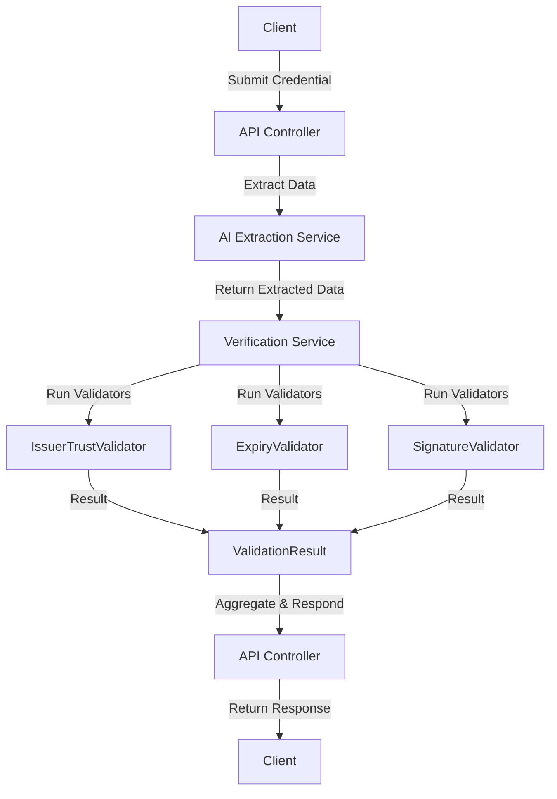

# Technical Specification: Credential Verification API

---

## 1. Overview
The Credential Verification API provides a secure, scalable, and AI-powered interface for external systems and users to submit digital credentials for automated verification. It supports multiple credential formats and returns structured, actionable results.

---

## 2. Modules & Components

### 2.1 API Layer (REST Controllers)
- **Endpoints:**
  - `POST /api/credentials/verify` – Accepts credential data (file or JSON) and returns verification results.
  - `POST /api/credentials/upload` – Accepts credential files for extraction and verification.
- **DTOs:**
  - `VerificationRequest` (input)
  - `VerificationResponse` (output)
- **Error Handling:**
  - Centralized via `GlobalExceptionHandler`.

### 2.2 Credential Extraction (AI Service)
- **Service:** `CredentialExtractionService` (uses AI or mock mode)
- **Supported Formats:** JSON, PDF, image (JPG/PNG)
- **Integration:** Calls `OpenAIVisionClient` for extraction.

### 2.3 Verification Pipeline
- **Service:** `VerificationService`
- **Validators:**
  - `IssuerTrustValidator`
  - `ExpiryValidator`
  - `SignatureValidator`
- **ValidationResult:** Aggregates results and reasons.

### 2.4 Security & Privacy
- **Authentication:** API keys or OAuth (TBD)
- **Authorization:** Role-based (user/system)
- **Data Handling:** Secure storage, transmission (TLS), and privacy compliance.
- **Rate Limiting:** Prevents abuse (configurable).

### 2.5 Monitoring & Logging
- **Usage Metrics:** API call counts, error rates.
- **Audit Logs:** Credential submissions and results.

---

## 3. Data Flow



---

## 4. API Contracts

### 4.1 VerificationRequest (DTO)
```json
{
  "credential": { /* JSON object or base64-encoded file */ },
  "format": "json|pdf|image",
  "metadata": { "issuer": "string", "type": "string" }
}
```

### 4.2 VerificationResponse (DTO)
```json
{
  "valid": true,
  "reasons": ["string"],
  "metadata": {
    "issuer": "string",
    "expiry": "ISO8601 date",
    "signatureValid": true
  },
  "errors": ["string"]
}
```

---

## 5. Error Cases
- **400 Bad Request:** Invalid payload, unsupported format.
- **401 Unauthorized:** Missing/invalid authentication.
- **403 Forbidden:** Insufficient permissions.
- **429 Too Many Requests:** Rate limit exceeded.
- **500 Internal Server Error:** Unexpected failures.
- **422 Unprocessable Entity:** Credential extraction/validation failed.

---

## 6. Security Considerations
- All endpoints require authentication.
- Input validation and sanitization.
- TLS enforced for all traffic.
- Sensitive data never logged.

---

## 7. Open Questions & Decisions
- Authentication method (API key vs OAuth) to be finalized.
- Credential format prioritization based on partner feedback.
- Performance targets to be set post-initial rollout.

---

## 8. Documentation & Integration
- OpenAPI/Swagger documentation for all endpoints.
- Example requests/responses provided.
- Integration guides for partners.

---

## 9. Summary
This specification defines the architecture, data flow, API contracts, and error handling for the Credential Verification API, ensuring robust, secure, and extensible credential validation for external consumers.
